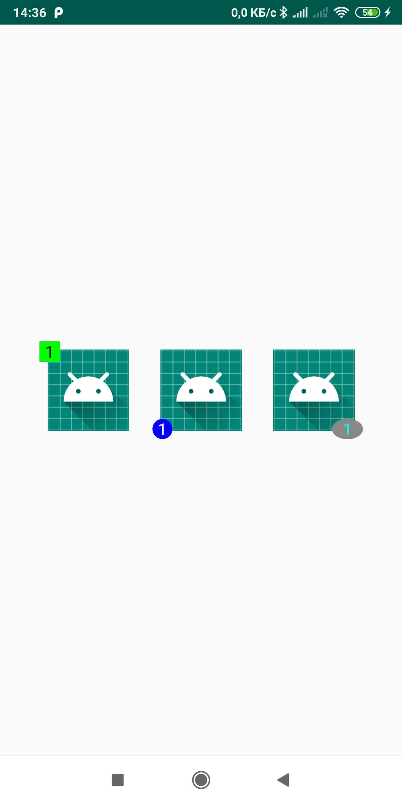

# BadgeView
[](https://jitpack.io/#popkovanton/BadgeView)
[](https://www.android.com)
[](https://android-arsenal.com/api?level=15)

**This is not the final version! Key functions subject to change.**

## Demo app
[]()

## Download

```groovy
repositories {
        maven { url "https://jitpack.io" }
}

dependencies {
      implementation 'com.github.popkovanton:BadgeView:$latest_version'
}
```
## Usage
```XML
<com.popkovanton.badgeviewlib.BadgeView
   android:id="@+id/badgeView"
   android:layout_width="match_parent"
   android:layout_height="match_parent"
   app:bv_badgeBackColor="@color/colorBlack"
   app:bv_badgeForwardColor="@color/colorBlack"
   app:bv_badgeGravity="left|bottom"
   app:bv_badgeHeight="@dimen/badge_size"
   app:bv_badgeWidth="@dimen/badge_size"
   app:bv_badgeShape="circle"
   app:bv_badgeTextColor="@color/colorWhite"
   app:bv_badgeTextSize="@dimen/badge_counter_size"
   app:bv_horizontalSpace="2dp"
   app:bv_verticalSpace="2dp" />
```
```groovy
ImageView imageParent = findViewById(R.id.imageParent);
BadgeView badgeView = BadgeFactory
       .create(this)
       .setBadgeBackground(Color.BLUE)
       .setForwardColor(Color.LTGRAY)
       .setTextColor(Color.WHITE)
       .setTextSize(18)
       .setShape(BadgeView.SHAPE_CIRCLE)
       .setBadgeGravity(Gravity.LEFT | Gravity.BOTTOM)
       .setBadgeHeight(20)
       .setBadgeWidth(20)
       .setSpace(2, 2)
       .setBadgeValue(1)
       .setDrawForward(false)
       .bind(imageParent);
```

## XML Attributes
| Attribute Name | Allowed Values |
| --- | --- |
| bv_badgeFontFamily  | Font Types |
| bv_badgeGravity  | top / bottom / left / right |
| bv_badgeShape  | circle / rectangle / oval / drawable |
| bv_badgeWidth  | integer / dimension |
| bv_badgeHeight  | integer / dimension |
| bv_badgeTextColor  | color |
| bv_badgeTextSize  | integer / dimension |
| bv_badgeBackColor  | color |
| bv_badgeForwardColor  | color |
| bv_horizontalSpace  | integer / dimension |
| bv_verticalSpace  |integer / dimension |
| bv_iconDrawable  | reference |